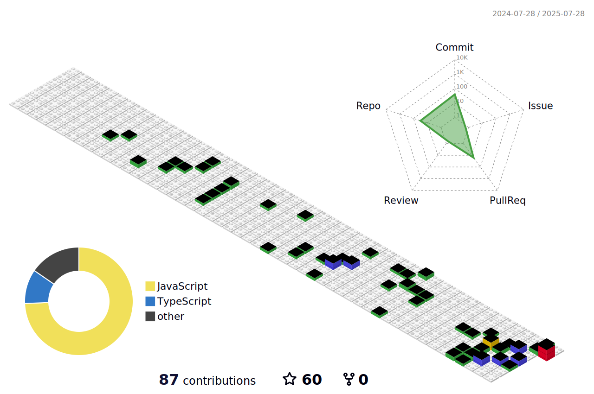

<h1 align="center">Thiago Oliveira</h1>

  Desenvolvedor Full Stack

---

---

## Sobre

- Desenvolvedor front-end em formação, com foco em HTML, CSS, JavaScript, React, TypeScript e SQL

- Estudante de Desenvolvimento de Sistemas no SENAI, com cursos complementares pela Alura, Rocketseat, Senac e Senai

- Habilidades interpessoais destacadas: comunicação, organização, atenção aos detalhes e multitarefa

- Motivado, autodidata e comprometido com o objetivo de se tornar desenvolvedor full stack

- Experiência prática em styled-components, CSS modules, Vite, Node.js e desenvolvimento web moderno

## Projetos em destaque

- [Toque AI](https://losttech.com.br/) – Plataforma de estudos para pessoas que estão querendo iniciar na área da programação
- [API-Artistas](https://suportededomingo.com.br/) – API feita em typescript e express com a intenção de melhorar minha noção referente ao back-end

## Contato

- [LinkedIn](https://www.linkedin.com/in/thiago-oliveira-225a5824b/)

---

> Educar é tornar o saber algo com voz, sentido e sentimento.
